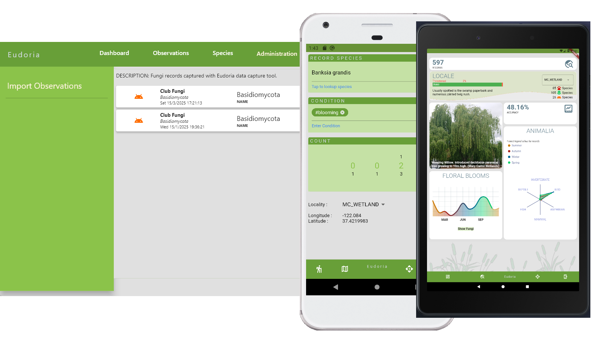

<!-- ABOUT THE PROJECT -->

## Eudoria 

<figure>
    

    
    

</figure>

Eudoria is an software application for recording, analysing and sharing ecological experiences. It provides an opportunity for measuring ecological conditions.

(<a href="#readme-top">back to top</a>)

## Features

+ Informatics for insights on observations.
+ Darwin core services for data sharing with Atlas of Living Australia.

(<a href="#readme-top">back to top</a>)

<!-- ACKNOWLEDGMENTS -->
## Acknowledgments

Inspirations were drawn from experiences at Mary Carroll Wetland. The park serves as a base point for personal observations. Thank you Friends Group for expertise, knowledge and morning teas! 💚💚

(<a href="#readme-top">back to top</a>)
