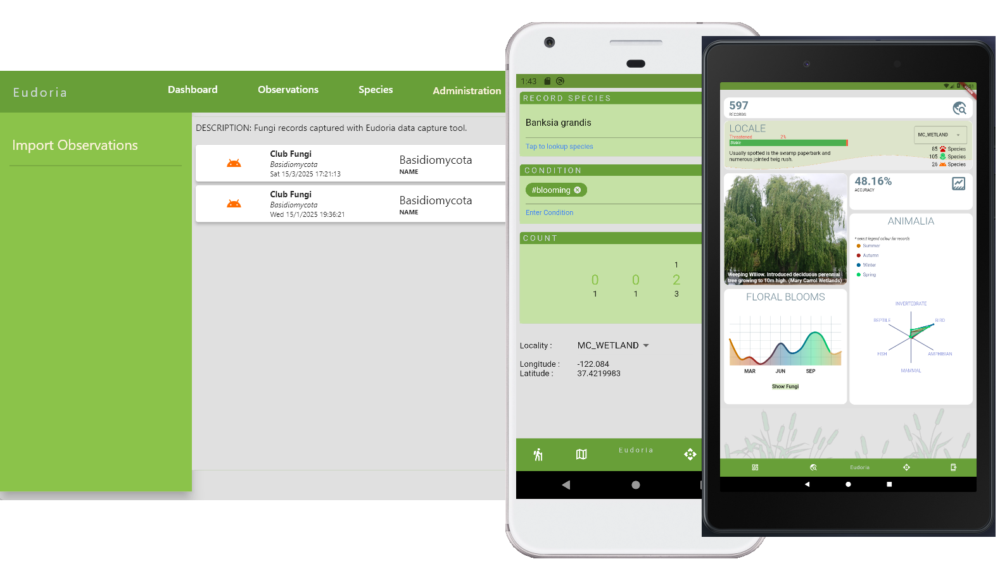

<!-- ABOUT THE PROJECT -->

## Eudoria 

<figure>
    

    
    

</figure>

Eudoria is an software application for recording, analysing and sharing ecological experiences. It provides an opportunity for measuring ecological conservation outcomes. 👀

(<a href="#readme-top">back to top</a>)

### Built With

This project follows the
[simple app state management
tutorial](https://flutter.dev/docs/development/data-and-backend/state-mgmt/simple) as a starting 
point for a Flutter application. The Flutter framework is used to leverage multi-platform
capabilities.

For help getting started with Flutter development, view the
[online documentation](https://flutter.dev/docs), which offers tutorials,
samples, guidance on mobile development, and a full API reference.

(<a href="#readme-top">back to top</a>)

<!-- ACKNOWLEDGMENTS -->
## Acknowledgments

Inspirations were drawn from experiences at Mary Carroll Wetland. The park serves as a base point for personal observations. Thank you Friends Group for expertise, knowledge and morning teas! 💚💚

(<a href="#readme-top">back to top</a>)
